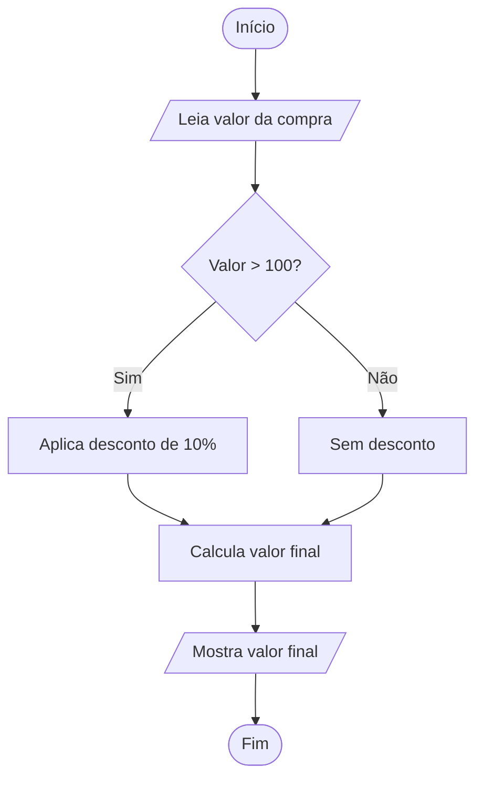

# Exercício 3 - Fluxograma

```mermaid
flowchart TD
    A([Início]) --> B[/Leia valor da compra/]
    B --> C{Valor > 100?}
    C -- Sim --> D[Aplica desconto de 10%]
    C -- Não --> E[Sem desconto]
    D --> F[Calcula valor final]
    E --> F
    F --> G[/Mostra valor final/]
    G --> H([Fim])
```